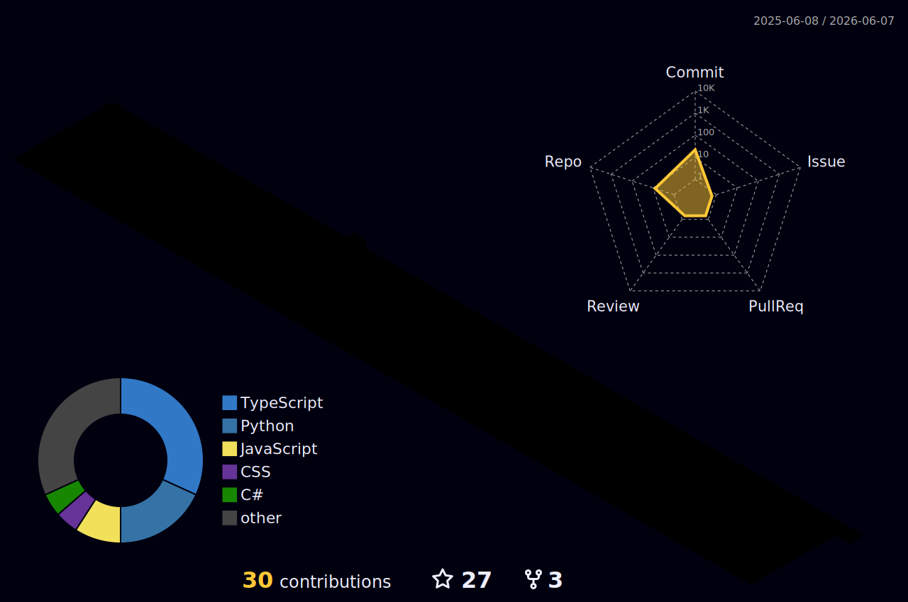

Aaron_Murillo01
<h1 align="center">Hi, I'm Aaron Murillo 👋</h1> 
 Software Engineer & Full‑Stack Developer  Albuquerque, NM, USA 
 
 <a href="https://www.aaronmurillo.dev">Portfolio</a> · <a href="https://github.com/AaronMurillo01">GitHub</a> · <a href="mailto:murillo.aaron102@gmail.com">Email</a> · <a href="https://www.linkedin.com/in/aaron-murillo/">LinkedIn</a> 

Professional Statement
Full-stack Software Engineer with experience designing and delivering production systems end to end. Energized by new challenges, whether that means diving into unfamiliar codebases, scaling infrastructure, or collaborating across teams to ship meaningful products.

Professional Statement
Full-stack Software Engineer with experience designing and delivering production systems end to end. Energized by new challenges, whether that means diving into unfamiliar codebases, scaling infrastructure, or collaborating across teams to ship meaningful products.

What I've Built
I've worked across defense systems, e-commerce platforms, and full-stack web apps. Some highlights - optimizing databases to significantly cut load times, building React interfaces that actually move the needle on conversions, and setting up CI/CD pipelines that took deployments from hours down to minutes.

How I Work
I care about writing code that's easy to come back to six months later. I lean toward shipping early, testing thoroughly, and keeping things secure. I learn best by building, and I like teams where people teach each other.

Get in Touch
📫 Email: murillo.aaron102@gmail.com
💼 LinkedIn: https://www.linkedin.com/in/aaron-murillo/
🌐 Portfolio: https://www.aaronmurillo.dev
📍 Location: Albuquerque, NM, USA

<!-- The 3D contribution graph above is generated via a GitHub Action using the "GitHub Profile 3D Contrib" workflow. Create a repository named after your GitHub username and add the workflow file `.github/workflows/profile-3d.yml` as described in the project's README. Once the workflow runs, it will produce SVG images in the `profile-3d-contrib` folder which you can reference in your README. -->
