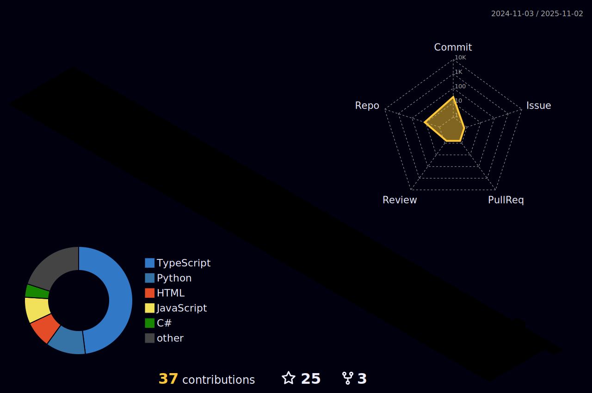

# Aaron_Murillo01

<h1 align="center">Hi, I'm Aaron Murillo 👋</h1> 
 Software Engineer & Full‑Stack Developer  Albuquerque, NM, USA 
 
 <a href="https://www.aaronmurillo.dev">Portfolio</a> · <a href="https://github.com/AaronMurillo01">GitHub</a> · <a href="mailto:murillo.aaron102@gmail.com">Email</a> · <a href="https://www.linkedin.com/in/aaron-murillo/">LinkedIn</a> 

Professional Statement

Software Engineer combining 4+ years of production experience with a continuous‑learning mindset. Built everything from real‑time systems to e‑commerce platforms using modern tech stacks. Excited about tackling ambiguity, scaling systems, and contributing to products that impact millions.

Key Achievements

Engineered high‑availability C++/Python systems for defense operations, enhancing operational efficiency and reliability.

Reduced load times by 40% through database optimization and indexing improvements.

Increased conversion rates by 15% through customer‑centric React innovations.

Deployed CI/CD pipelines that cut deployment time from hours to under 30 minutes.

Expedited feature delivery by 25% via comprehensive testing automation.

What I Value

Clean, maintainable code

Security and compliance

Performance optimization

Team collaboration and mentoring

Continuous learning

Technical Skills

JavaScript TypeScript Python C/C++ React.js Next.js Redux Node.js Express.js Django PostgreSQL MySQL MongoDB Docker Git/GitHub REST APIs Agile/Scrum

Featured Projects

Zenith Dashboard — Modern SaaS admin dashboard with AI assistant and real‑time collaboration.
Repo: https://github.com/AaronMurillo01/zenith-dashboard
· Live: https://zenith.example.com

DNA Photography — Lightning‑fast portfolio site for a local photography business.
Repo: https://github.com/AaronMurillo01/dna-photography
· Live: https://www.instagram.com/dnaphotography._/

More projects at https://www.aaronmurillo.dev/projects

Get in Touch

📫 Email: murillo.aaron102@gmail.com

💼 LinkedIn: https://www.linkedin.com/in/aaron-murillo/

🌐 Portfolio: https://www.aaronmurillo.dev

📍 Location: Albuquerque, NM, USA

<!-- The 3D contribution graph above is generated via a GitHub Action using the "GitHub Profile 3D Contrib" workflow. Create a repository named after your GitHub username and add the workflow file `.github/workflows/profile-3d.yml` as described in the project's README. Once the workflow runs, it will produce SVG images in the `profile-3d-contrib` folder which you can reference in your README. -->
